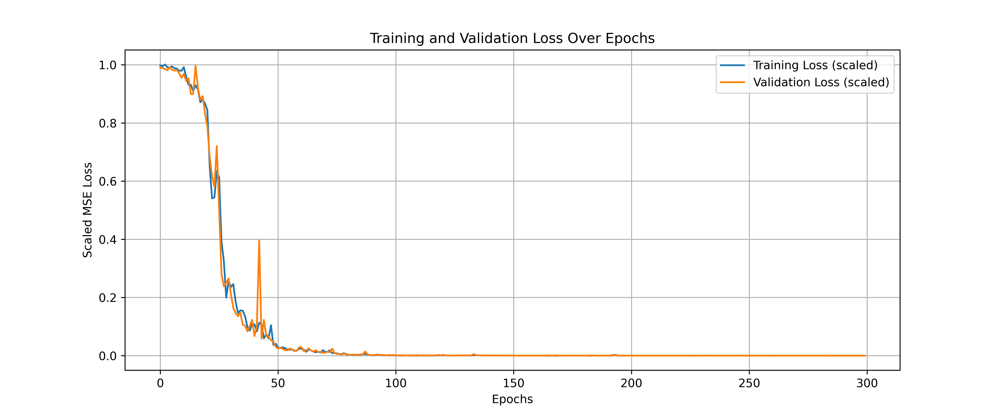
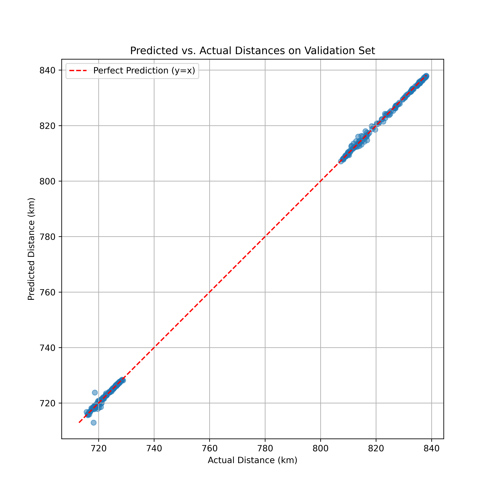

# Practical GNNs for Space-Air-Ground Integrated Networks (SAGINs)

Welcome to the open-source repository for applying Graph Neural Networks (GNNs) to practical challenges in Space-Air-Ground Integrated Networks (SAGINs) and Non-Terrestrial Networks (NTNs).

## 🎯 Project Goal

SAGINs/NTNs, comprising thousands of satellites, aerial platforms, and ground stations, are fundamentally large-scale, heterogeneous, and highly dynamic graphs. Traditional network management techniques often struggle to optimize performance in such a fluid topology.

This project aims to build an open-source toolkit of practical Proof of Concepts (PoCs) that demonstrate how GNNs can solve core problems in SAGINs, from link quality prediction and intelligent routing to resource management.

---

## 🚀 Proof of Concepts (PoCs)

A list of completed and in-progress experiments:

*   ✅ **PoC #1: Link Quality Prediction**
*   ⏳ PoC #2: Dynamic Routing with Reinforcement Learning - *Coming Soon!*

---

## ⚙️ Setup & Environment

This project uses Conda for environment management.

**Prerequisites:**
*   Git
*   Miniconda or Anaconda
*   An NVIDIA GPU with drivers supporting CUDA 12.1+

**Installation Steps:**

1.  **Clone the repository:**
    ```bash
    git clone https://github.com/ailabteam/gnn-for-sagin.git
    cd gnn-for-sagin
    ```

2.  **Create and activate the Conda environment:**
    ```bash
    conda create --name gnn_sagin python=3.11 -y
    conda activate gnn_sagin
    ```

3.  **Install the required libraries:**
    ```bash
    # Install PyTorch compatible with CUDA 12.1
    pip3 install torch torchvision torchaudio --index-url https://download.pytorch.org/whl/cu121
    
    # Install GNN libraries and other dependencies
    pip install torch_geometric pandas matplotlib seaborn skyfield tqdm
    ```

---

## ⚡ Running the Experiments

### PoC #1: Link Quality Prediction

This experiment builds a hybrid GNN-GRU model to predict the distance (as a proxy for link quality) between satellites at a future time step `t+1` based on a sequence of past network states.

**Step 1: Generate Simulation Data**

Run the following script to simulate the orbits of a satellite constellation for 24 hours and save the network graph snapshots.

```bash
python src/data_simulation.py
```
*The resulting data file will be saved at `data/processed/sagin_simulation_dataset.pt`.*

**Step 2: Train the Model**

Execute the main training script. This will automatically load the data, build the model, run the training loop, and save the results.

```bash
python -m src.train
```
*Upon completion, the trained model will be saved as `gnn_gru_predictor.pth`, and result plots will be saved as `.png` files.*

### PoC #1 Results

The model demonstrates extremely rapid convergence and achieves high prediction accuracy, validating the hybrid GNN-RNN architecture as a powerful approach for spatio-temporal graph forecasting problems.

#### **Training Curve**
The training and validation loss curves show a steep decline and stable convergence, indicating that the model learns effectively without overfitting.



#### **Prediction Accuracy**
The scatter plot of predicted vs. actual values on the validation set shows that data points align almost perfectly along the `y=x` line, signifying a very low prediction error.



### 📺 Video Demo (PoC #1)

For a more visual explanation of the problem and the results, please watch the video demo:

➡️ **[Watch the Demo on YouTube](https://youtu.be/Voqlf9fgnGk)**

---

## 🐳 Deployment with Docker (Optional)

To ensure full reproducibility and ease of deployment, a pre-built Docker image for this project is available.

1.  **Pull the image from Docker Hub:**
    ```bash
    docker pull haodpsut/gnn-for-sagin:poc1
    ```
    *(Docker Hub link to be updated upon image build)*

2.  **Run the container:**
    ```bash
    # Commands to run the container and execute training will be updated here
    ```

---

## 🤝 Contributing & Future Work

Contributions and new ideas are always welcome. Future development directions include:
*   Implementing PoC #2 on dynamic routing.
*   Scaling the simulation with larger satellite constellations.
*   Experimenting with other advanced GNN architectures.

Feel free to open an `Issue` or submit a `Pull Request`!

## 📜 License

This project is licensed under the MIT License.
